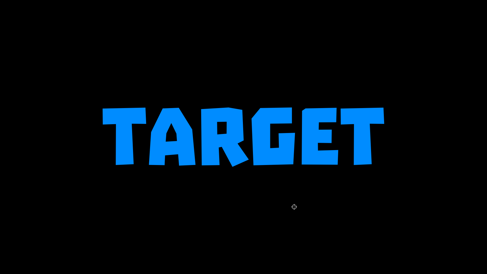
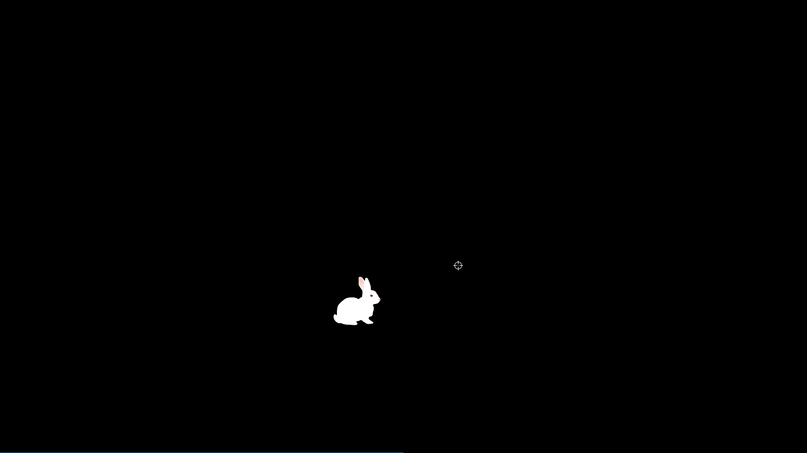
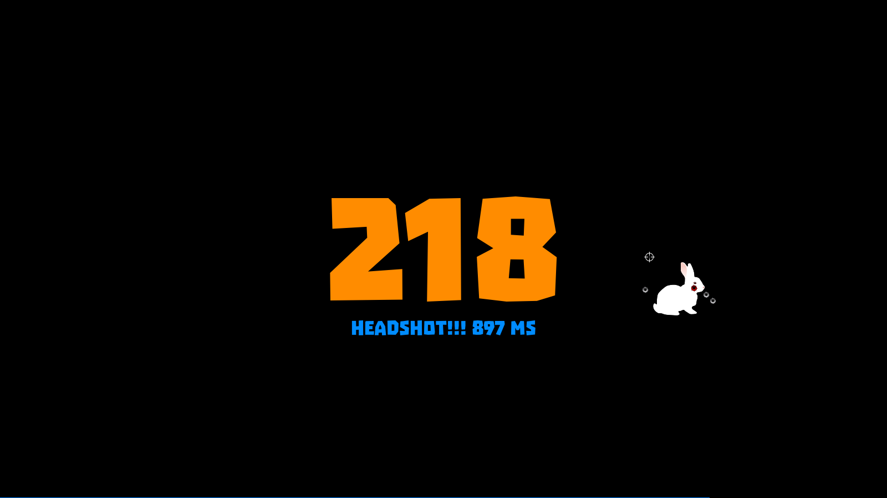
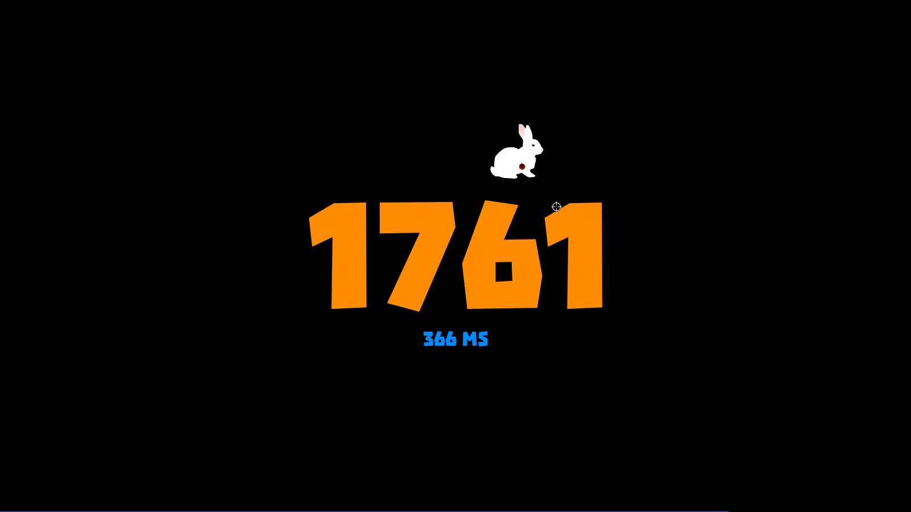
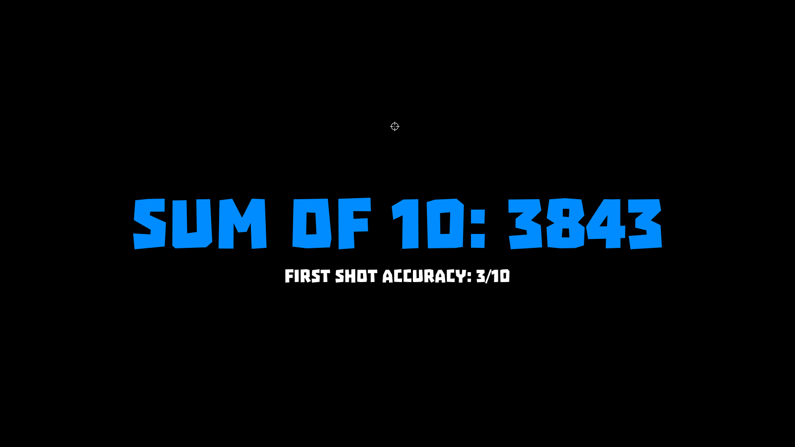
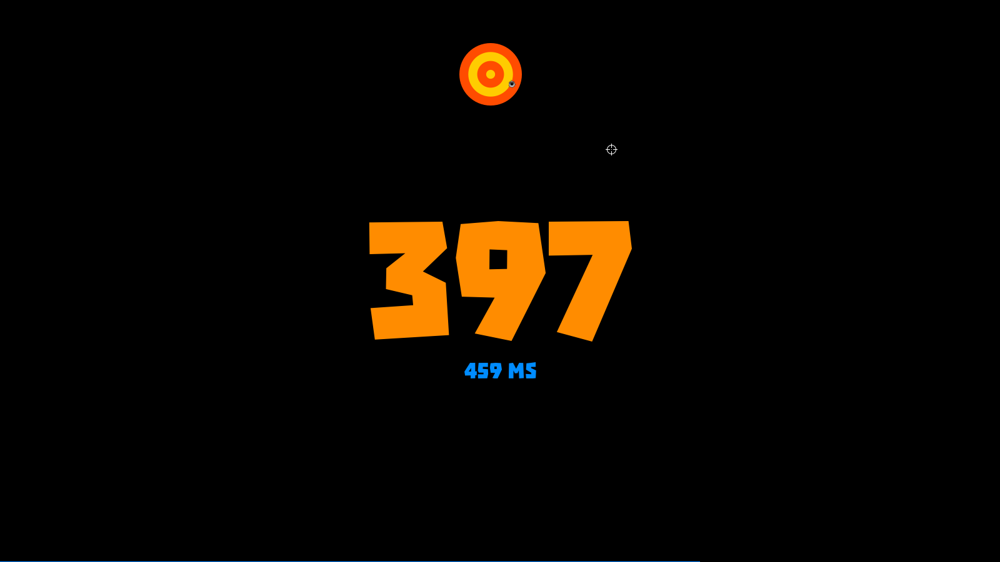

# Target

Target is a simple 2D game where you must shoot a target as quickly as possible to get high points. 
A target appears in random place and with random latency so you can't predict where and when it'll
spawn next time. 

After each successful shot, points and time for this shot are drawn.
After each 10 shots you'll see sum of points for those shots.

This game aims for testing one's reaction and input device settings comfort. 

### Screenshots

 
 
 
 

### Warning
**IT IS STROGLY RECOMMENDED TO INSTALL 'TROIKA' FONT INTO YOUR SYSTEM! 
DO NOT RUN THE GAME IF 'TROIKA' FONT IS NOT INSTALLED OR I WILL SMASH YOUR ASS. I PROMISE.**

You can download free **Troika** font from [dafont.com](http://www.dafont.com/troika.font).

To install the font just copy `troika.otf` file into your system's font directory, e.g. `~/.fonts/`.
Consult your distribution manual or wiki for the dir location.
You also may check `/etc/fonts/fonts.conf` for fonts directories list.

### Compile && run

    ./build_target.sh && ./target

### Dependencies

    GCC
    SDL 1.2
    Cairo (my version is 1.14)
    Troika font (strongly recommended)

### Resources

All resources must reside in `res` directory.

**Images:**

    shot.png
    rabbit_values.png
    
**Wave files:**

    sniper.wav  (shot sound)
    rabbit.wav  (rabbit appear sound)
    reload.wav  (gun reload sound)
    blood.wav   (this one is a mix of a shot and bloody smash sounds)
    
    pop.wav     (optional replacement for 'rabbit.wav' when 'NO_RABBIT_PLEASE' is defined)
    hit.wav     (optional replacement for 'blood.wav' when 'NO_RABBIT_PLEASE' is defined)
    
All waves must be in same format, for now they're `pcm_s16le, 48k, mono`. 
You will get SEGFAULT if any of required sound file is absent.

### Installation:

If you wish to install the game, then you should define `RES_PATH` and `STAT_PATH` as absolute paths, 
compile and copy the files to selected location, e.g.:
    
    INSTALL_PATH='/opt/target_game/'

    ./build_target.sh "-DRES_PATH=\"$INSTALL_PATH\"" "-DSTAT_PATH=\"$HOME/\""
    mkdir -p "$INSTALL_PATH"
    cp -r target res "$INSTALL_PATH"

    ln -s "$INSTALL_PATH/target" ~/.local/bin/target
    unset INSTALL_PATH

### Records

Theoretical maximum for **one shot** is ~7000 points — you must shot the rabbit right in the center of the head
in 150 ms. This is almost unreachable for average human as mean "static" reaction time is about 200 ms 
but there are individuals who can react slightly faster.
[Read more about human reaction time and test yourself](https://www.pubnub.com/blog/2015-02-09-how-fast-is-realtime-human-perception-and-technology/).

My current record is 8893 (sum of 10) for 1600x900 window size, average time for those 10 shots was 619.6&nbsp;ms 
(`[446, 456, 466, 456, 375, 1117, 1018, 385, 782, 695]`). 
My average "sum" for the last 100 games is 3760. I shot with right click.

After every 10 shots a line with the sum is added to `.target_stat` file. Time for every shot is duplicated to stdout.

### Points calculation

Time has more influence than aiming. The formula is 

    Points = (1200 + 200*Headshot) * Vulnerability * 0.1^t,
    
where

    Headshot is 1 or 0,
    Vulnerability is real from 0 to 1, see 'res/rabbit_values.png',
    t = (Time_ms - 500) / 500,
            
so, after 2 seconds `0.1^t` will be equal to 0.001 — almost nothing.

### Poor rabbit

You can run the game with `no_rabbit_please` argument if you can't watch a rabbit gets shot, then instead of the rabbit 
a round target made of concentric circles will be used. 

    ./target no_rabbit_please

Actually, any argument disables rabbit.

Of course, no headshots. And maybe it's little bit more difficult to get comparable points with round target 
due to it's "vulnerability" proportionality to radius, while rabbit has areas of "full vulnerability". Also 
rabbit's "average vulnerability" is higher then the round target's, but shapes compensate this difference
a little.

